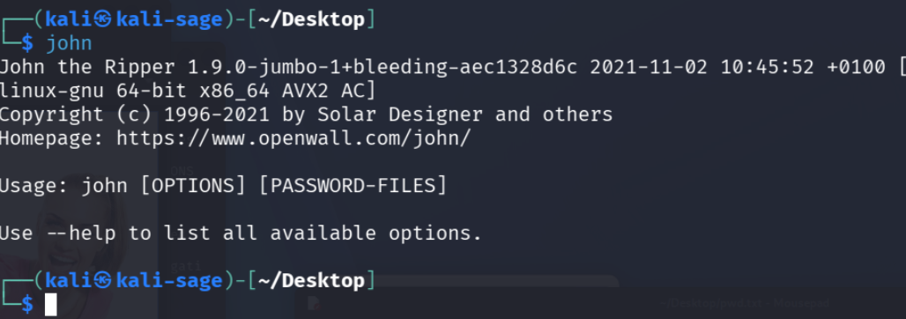
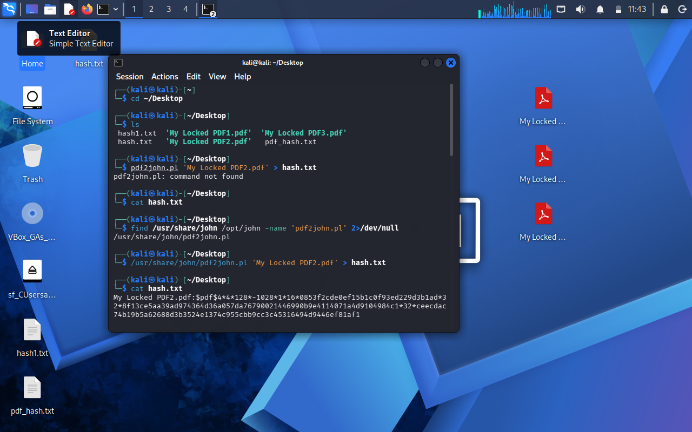
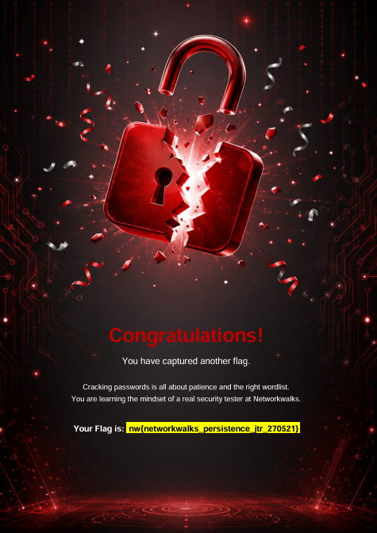
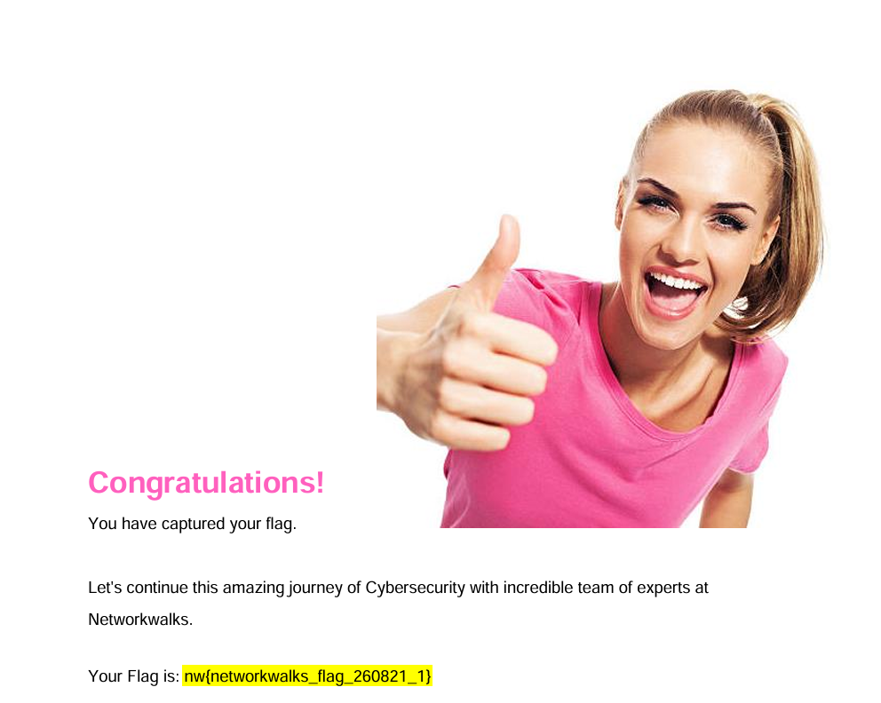
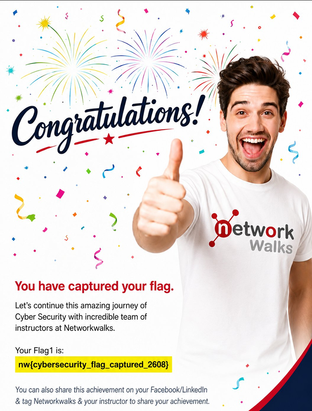

**WEEK 3 | PROJECT MODULE 1*

<h2 align="center">PASSWORD CRACKING REPORT</h2>
<h3 align="center">RECOVERING PDF PASSWORDS WITH JTR (KALI LINUX) & Networkwalks tool</h3>
<h6 align="center">Targets: My Locked PDF1.pdf, My Locked PDF2.pdf, My Locked PDF3.pdf
<h7 align="center">Environment: Kali Linux  |  Date: [ 20 SEP 2026 ]

  
 📚Week-3 project Module - 1 & 2
 ---
 
 This repository contains my week 3 project of cyber security practical projects which is a part of my Cybersecurity learning journey.This contains 2 tools :-
- 🌐Module1-Password cracking with John the Ripper (JTR)
- 🔑Module2-Password cracking with Networkwalks tools.
  
  ---
  **Liability Disclaimer**
  ---
 
This exercise was performed only against password-protected files provided for the purpose of this lab, as part of the Networkwalks Cybersecurity Program. The content of this report is intended strictly for educational and research purposes. Password-cracking tools such as John the Ripper must only be used against files or systems for which explicit permission has been granted, or which belong to the author. Using these techniques against files or accounts without authorization is illegal in most jurisdictions, even where no damage occurs. The author, instructors and Networkwalks bear no responsibility for any misuse of the information contained here
This practical exercise helps me to learn hashes,password security,Linux-command line & authorised password recovery technique.

--
 ⚠️Important -All techniques demonstrated in this repository is performed in an isolated lab for education purpose only.Never  use password cracking technique against system,files or accounts without anexplicit permission.Misleading can be lead to unethical crime.
 
 ---
 📌 Project Overview
 -
| 🧩 Module | Project | Environment | ⚙️ Main Tools |
| :---: | :--- | :--- | :--- |
| 1 | Password Cracking with JTR | Kali Linux | 🃏 John the Ripper |
| 2 | Password Cracking with Networkwalks Tools | Web Browser | 🌐 Networkwalks Password Cracker |

---

<h2 align="center">🃏** Module 1 — Password Cracking with John the Ripper</h2>
---

📌**Introduction**
--
🃏 John the Ripper (JTR) is one of the most widely used password-cracking tools in the security industry, originally built for Unix systems and now available on Windows, Linux and macOS. It supports a large number of password hash formats and can also recover passwords from protected files such as PDF, ZIP and Microsoft Office documents. Johnny is the official graphical front-end for John the Ripper, aimed at beginners who prefer a point-and-click interface over the command line.
The lab task set out to crack the password of a protected PDF file  using John the Ripper directly on Kali Linux through the terminal.
Because John the Ripper comes pre-installed on Kali Linux, the cracking stage of this task was instead completed natively on Kali, without installing John or Johnny separately. The hash for each PDF was still obtained from www.onlinehashcrack.com as in the original guide, but once the hash was in hand, it was saved to a text file and cracked directly from the Kali Linux terminal using john with a wordlist attack, rather than loading it into the Windows Johnny GUI.

 This report covers three password-recovery attempts, one for each of the following files:
- My Locked PDF1.pdf
- My Locked PDF2.pdf
- My Locked PDF3.pdf
  
 Components
 ---
 
| ⚙️ Main Tools | Purpose |
| :---: | :--- |
| kali linux | This OS provides pre-installed JTR tool to run  |
| www.onlinehashcrack.com | 🌐 online hash extractor,gives crackable hash through pdf upload |
| John the ripper (John) | Command-line password-cracking engine; runs the actual dictionary/brute-force attack against the extracted hash |
| rockyou.txt |	Wordlist used to run a dictionary attack against the extracted PDF hash |

Targeted pdf 1
--

Step 1 :- The starting point was a password-protected PDF that could not be opened without the correct password.

Step 2 :-Open terminal and run command john to check if it is available or not?
      

Step 3 :- Now nevigate to the directory to check where is the file located the command is 

                        cd ~/Desktop
                         ⬇️
                         ls
                         ⬇️
                        cd ~/Desktop
                          ⬇️
                       pdf2john.pl 'My Locked PDF1.pdf' > hash.txt
                       
   Step 4 :- When this command gave output :-command not found then we run
                            ⬇️ 
                            
             find /usr/share/john /opt/john -name 'pdf2john.pl' 2>/dev/null
                              ⬇️
                             cat hash.txt
                             
 Step 5 :- The resulting hash1.txt file contained the hash in the standard $pdf$... format, ready to be cracked.
 
 
 
 Step 6 :- Now run command 
 
        john hash.txt

--
Step 7 :- Now capture the other two embedded flags from each of pdf 2,pdf3 by repeating the same process .
         

         --
   

 
