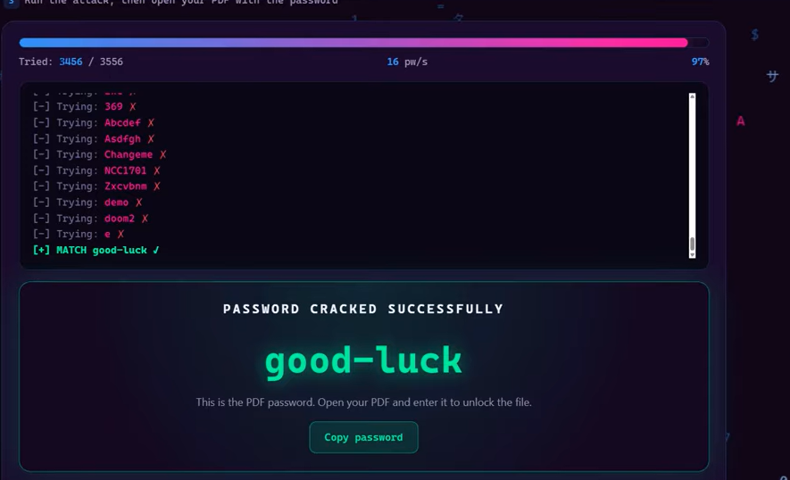
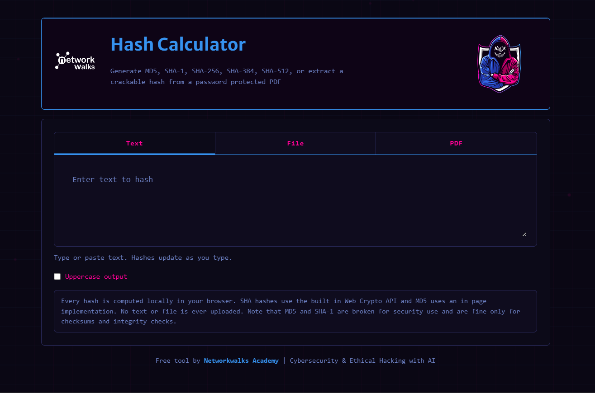
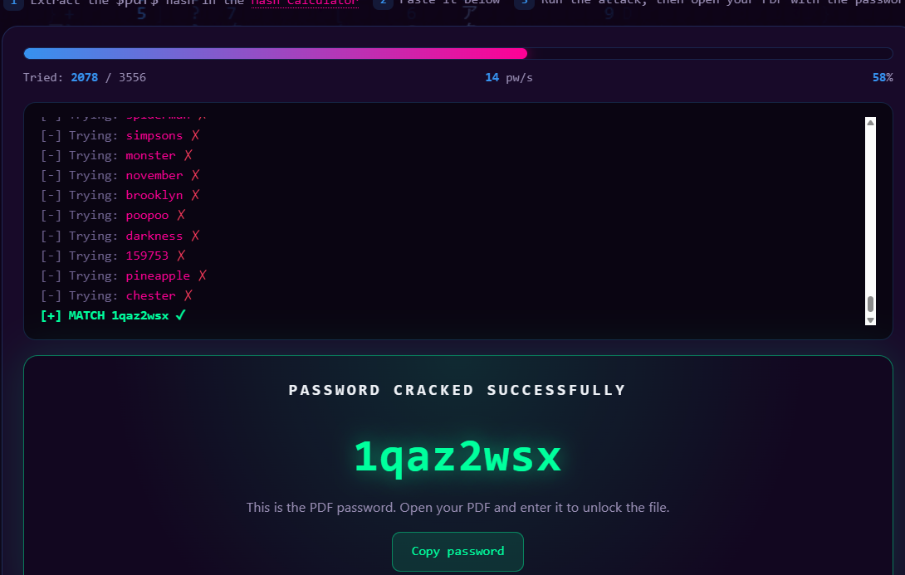

**WEEK 3 | PROJECT MODULE 1*

<h2 align="center">PASSWORD CRACKING REPORT</h2>
<h3 align="center">RECOVERING PDF PASSWORDS WITH JTR (KALI LINUX) & Networkwalks tool</h3>
<h6 align="center">Targets: My Locked PDF1.pdf, My Locked PDF2.pdf, My Locked PDF3.pdf
<h7 align="center">Environment: Kali Linux  |  Date: [ 20 SEP 2026 ]

  
 📚Week-3 project Module - 1 & 2
 ---
 
 This repository contains my week 3 project of cyber security practical projects which is a part of my Cybersecurity learning journey.This contains 2 tools :-
- 🌐Module1-Password cracking with John the Ripper (JTR)
- 🔑Module2-Password cracking with Networkwalks tools.
  
  ---
  **Liability Disclaimer**
  ---
 
This exercise was performed only against password-protected files provided for the purpose of this lab, as part of the Networkwalks Cybersecurity Program. The content of this report is intended strictly for educational and research purposes. Password-cracking tools such as John the Ripper must only be used against files or systems for which explicit permission has been granted, or which belong to the author. Using these techniques against files or accounts without authorization is illegal in most jurisdictions, even where no damage occurs. The author, instructors and Networkwalks bear no responsibility for any misuse of the information contained here
This practical exercise helps me to learn hashes,password security,Linux-command line & authorised password recovery technique.

--
 ⚠️Important -All techniques demonstrated in this repository is performed in an isolated lab for education purpose only.Never  use password cracking technique against system,files or accounts without anexplicit permission.Misleading can be lead to unethical crime.
 
 ---
 📌 Project Overview
 -
| 🧩 Module | Project | Environment | ⚙️ Main Tools |
| :---: | :--- | :--- | :--- |
| 1 | Password Cracking with JTR | Kali Linux | 🃏 John the Ripper |
| 2 | Password Cracking with Networkwalks Tools | Web Browser | 🌐 Networkwalks Password Cracker |

---

<h2 align="center">🃏** Module 1 — Password Cracking with John the Ripper</h2>
---

📌**Introduction**
--
🃏 John the Ripper (JTR) is one of the most widely used password-cracking tools in the security industry, originally built for Unix systems and now available on Windows, Linux and macOS. It supports a large number of password hash formats and can also recover passwords from protected files such as PDF, ZIP and Microsoft Office documents. Johnny is the official graphical front-end for John the Ripper, aimed at beginners who prefer a point-and-click interface over the command line.
The lab task set out to crack the password of a protected PDF file  using John the Ripper directly on Kali Linux through the terminal.
Because John the Ripper comes pre-installed on Kali Linux, the cracking stage of this task was instead completed natively on Kali, without installing John or Johnny separately. The hash for each PDF was still obtained from www.onlinehashcrack.com as in the original guide, but once the hash was in hand, it was saved to a text file and cracked directly from the Kali Linux terminal using john with a wordlist attack, rather than loading it into the Windows Johnny GUI.

 This report covers three password-recovery attempts, one for each of the following files:
- My Locked PDF1.pdf
- My Locked PDF2.pdf
- My Locked PDF3.pdf
  
 Components
 ---
 
| ⚙️ Main Tools | Purpose |
| :---: | :--- |
| kali linux | This OS provides pre-installed JTR tool to run  |
| www.onlinehashcrack.com | 🌐 online hash extractor,gives crackable hash through pdf upload |
| John the ripper (John) | Command-line password-cracking engine; runs the actual dictionary/brute-force attack against the extracted hash |
| rockyou.txt |	Wordlist used to run a dictionary attack against the extracted PDF hash |

Targeted pdf 1
--

Step 1 :- The starting point was a password-protected PDF that could not be opened without the correct password.

Step 2 :-Open terminal and run command john to check if it is available or not?
      

Step 3 :- Now nevigate to the directory to check where is the file located the command is 

                        cd ~/Desktop
                         ⬇️
                         ls
                         ⬇️
                        cd ~/Desktop
                          ⬇️
                       pdf2john.pl 'My Locked PDF1.pdf' > hash.txt
                       
   Step 4 :- When this command gave output :-command not found then we run
                            ⬇️ 
                            
             find /usr/share/john /opt/john -name 'pdf2john.pl' 2>/dev/null
                              ⬇️
                             cat hash.txt
                             
 Step 5 :- The resulting hash1.txt file contained the hash in the standard $pdf$... format, ready to be cracked.
 
 
 
 Step 6 :- Now run command 
 
        john hash.txt

--
Step 7 :- Now capture the other two embedded flags from each of pdf 2,pdf3 by repeating the same process .

Targeted pdf 2
--
   
--

 Targeted pdf 3 
    --
   

   ------------------------
   
   <h2 align="center">🃏** Module 2 — Password Cracking with Networkwalks Tool
------------------------------------------------------------------------------------------------------------------

     
     🛡️ **SAFE** -_This lab does the same job as JTR lab but Free- browser tools in web-browser🌐 without installing it.It runs in the lab with written permission by  authorized organisation to practice on given project/lab for education purpose only._
 
   ㊙️**Tools**-
--
- Networkwalks Hash-Calculator
- Networkwalks Password Cracker
  
     Step 1 :- Open Password Cracker to upload wordlist '.' In hash calculator the hash lines we got from PDF1 is not crackable in the password cracker.So,
  
    Step 2 :-Now upload it and start cracking we get password match
  
  

  Step 5:- Now moved to PDF 2 :-
  
  Opening Hash-calculator then I Uploaded the locked PDF to the Hash Calculator to get the hash lines.
        The Hash Calculator supports MD5, SHA-1, SHA-256, SHA-384, and SHA-512 or extract a crackable hash from dedicated file .
        
        
 Step 6 :-Now copy the hash lines from pdf ie $pdf$...
 Step 7 :- Now pasted the hash lines in Password Cracker .Then we opened our file by password
 

 Step 8 :- Do same at PDF 3 to open the file by password
     
     
  

Result
---
## 🔐 PDF Password Cracking Report

| PDF File        | Method                       | Environment    | Result                                |Level 
|-----------------|------------------------------|--------------- |---------------------------------------|------- |
| MyLockedPDF1.pdf | John the Ripper (CLI)       | Kali-Linux     | ✅ Password recovered🗝️,Flag captured|Medium🟡| 
| MyLockedPDF2.pdf | John the Ripper (CLI)       |  Kali-Linux    | ✅ Password recovered, flag captured  |Medium  |
| MyLockedPDF3.pdf | John the Ripper (CLI)       | Kali-Linux     | ✅ Password recovered, flag captured  |Medium🟡|
| MyLockedPDF1.pdf | Networkwalks Tools          | Web-browser    | ✅ Password recovered,flag captured   |High🔴  |
| MyLockedPDF2.pdf | Networkwalks Tools          | Web-browser    | ✅ Password recovered, flag captured  |Low 🟢  |               
| MyLockedPDF3.pdf | Networkwalks Tools          | Web-browser    | ✅ Password recovered, flag captured  |Low 🟢  |

-----------
☑️Key Learning
--
- I learned how to maintain report writing during attack '.' it is very important to write in Ethical professional career.
- I gain experience on john the Ripper tool and Networkwalks tools.
- I learned command in kali VM.
- Observed firsthand how a password cracker tests candidate passwords from a wordlist  by Dictionary attack against a target hash until a match is found — and how quickly this succeeds against common, weak passwords.
- The main purpose of this project are :-
   -  How password cracker is used for ethical purpose only with explicit permission.Never do unethical way to compromised the file because it can lead to cyber-crime.
   -  Understand the protectiveness of the password .
     
   -Week 3 provided hands-on exposure to password-cracking workflows using both traditional command-line tooling and modern browser-based security tools. The project strengthened my understanding of how protected files are analyzed, how crackable hashes are extracted, how dictionary attacks work in practice, and how recovered credentials are verified in a controlled, ethical environment.  

     -----
Problem and solution 💡During project
--
Module 1:-When i tried to open the pdf in Vm it was difficult to copy it in the lab.Then i enable the media and select the path and run the command in vm then i was able to find the password from the locked pdfs

Module 2:- I tried to crack the hash lines extracted from 'My Locked PDF1' due to  heavy wordlists the password was not found .Then i went to youtube and watched Instructor guideliness and follow the steps then i do the same steps which mentioned i was able to open the PDF1.

⚖️ Ethical & Legal Scope
--
This work was performed as part of a controlled cybersecurity training lab using files provided specifically for this educational exercise.

Password-cracking techniques should only ever be used against systems, files, or accounts for which you have explicit authorization. The purpose of this project was strictly to understand:

- Password security and hash extraction
- Dictionary-based attack mechanics
- Password recovery workflows
- Ethical hacking methodology
- Defensive security awareness

  --
  👤 Author
  -- 
  ANJU
  Cybersecurity Intern BO83

LinkedIn: www.linkedin.com/in/anju-84b8ba394
  
